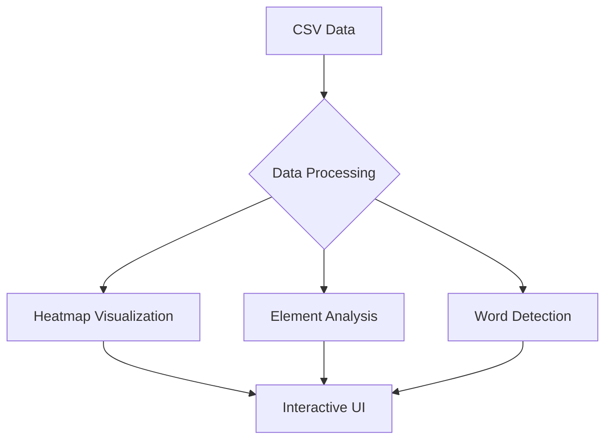

# Eye Tracking Visualization & Analysis Toolkit

[![Project Preview]


A web-based visualization tool that processes eye-tracking data to create interactive heatmaps, analyze reading patterns, and provide insights into user attention distribution across web content.

## Key Features

- **Gaze Heatmap Visualization**  
  Dynamic red-shaded heatmap showing gaze concentration using p5.js
- **Content Element Analytics**  
  Statistics on viewed elements (headings, paragraphs, images, etc.)
- **Gaze Word Cloud**  
  Interactive visualization of most-viewed words with size-frequency mapping
- **Alpha Adjustment Control**  
  Real-time opacity control for heatmap customization
- **Interactive UI Components**  
  Draggable windows, dynamic buttons, and scrollable data panels
- **Device Data Integration**  
  CSV data processing from eye-tracking devices

## Technologies Used

[](https://p5js.org/)
[](https://developer.mozilla.org/en-US/docs/Web/JavaScript)
[](https://developer.mozilla.org/en-US/docs/Web/HTML)
[](https://developer.mozilla.org/en-US/docs/Web/CSS)

## Installation & Usage

### Prerequisites
- Web browser with JavaScript enabled
- Local server for testing (VS Code Live Server recommended)
- Eye-tracking data in CSV format

### Quick Start
1. Clone repository:
   ```bash
   git clone https://github.comgurvender02/GazeTrack
   ```
2. Place your eye-tracking data file (`d2.csv`) in project root
3. Launch using:
   ```bash
   python -m http.server 8000
   ```
   or use VS Code Live Server extension

### Data Preparation
Ensure CSV file contains these columns:
- FPOGV (valid gaze flag)
- FPOGX (normalized X coordinate)
- FPOGY (normalized Y coordinate) 
- FPOGD (gaze duration)

## Key Functionality

### Interactive Controls
- **Show Statistics Button**: Top-right button generates element interaction report
- **Gaze Words Button**: Displays word frequency visualization
- **Alpha Slider**: Bottom-left control adjusts heatmap opacity


### Data Processing
```javascript
// Sample data mapping
const x = map(row.getNum('FPOGX'), 0, 1, 0, window.innerWidth);
const y = map(row.getNum('FPOGY'), 0, 1, 0, window.innerHeight);
const duration = row.getNum('FPOGD');
```

### Analysis Features
1. Element Type Detection:
   ```javascript
   function getElementType(el) {
     // Hierarchical element detection logic
     if (tag.match(/^h[1-6]$/)) return 'Heading';
     if (tag === 'img') return 'Image';
     // ... other element checks
   }
   ```
2. Word Frequency Analysis:
   ```javascript
   function detectWordsAt(x, y, radius, duration) {
     // Text node analysis and word extraction
     const word = getWordAt(text, offset);
   }
   ```

## Technical Architecture



## Contributing

We welcome contributions! Please follow these steps:
1. Fork the project
2. Create your feature branch (`git checkout -b feature/AmazingFeature`)
3. Commit changes (`git commit -m 'Add some AmazingFeature'`)
4. Push to branch (`git push origin feature/AmazingFeature`)
5. Open a Pull Request

## License

Distributed under MIT License. See `LICENSE` for more information.

## Acknowledgements

- p5.js library team
- Eye-tracking data providers
- Open source community contributors

---

**Happy Eye Tracking Analysis!** 👁️📊
```
